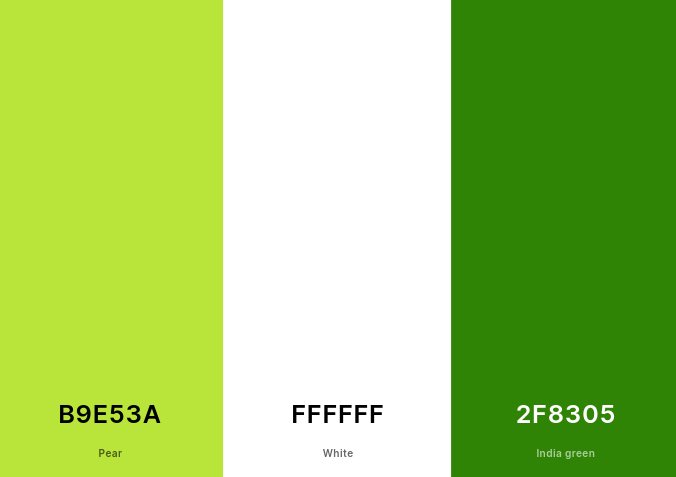

# ReviewME

AMIRESPONSIVE IMAGE

## Introduction

ReviewME is a social media platform where users can review a beauty product and share their experience with others. We understand the importance of self-care and believe that everyone deserves to feel confident and beautiful.
And this platform was designed as a tool to provide honest feedback and analysis of a specific beauty product (i.e creams, oils, makeup ).
Nowdays, internet and social media is marketed in a way that makes it hard to find trustworthy sources, as such, Review is the perfect app to identify and consult honest feedback left in realtime.

The backend DRF API linked to this project, is available [here](<(https://github.com/aimansae/reviewme-api)>) All details have been documented carefully in README file.

## Live Site

Deployed Frontend live link AGGIUNGI
[Deployed Backend API link](https://drf-reviewme.herokuapp.com/)

## Github Repository"

[Frontend Repository](https://github.com/aimansae/reviewme)  
[Backend Repository](https://github.com/aimansae/reviewme-api)

## Table Of Contents

- [Introduction](#introduction "Introduction")
  - [Live-site](#live-site "Live Site")
  - [Github Repository](#github-repository "Github Repository")
- [Ux User Experience](#ux-user-experience "UX User Experience")
  - [User Stories](#user-stories "User Stories") LINK
  - [Agile Methodology](#agile-methodology "Agile Methodology")
  - [Design](#design "Design")
    - [Typography](#typography "Typography")
    - [Wireframes](#wireframes "Wireframes")
- [Features](#features "Features")
  - [Navbar](#navbar "Navbar")
  - [Homepage](#homepage "Homepage")
  - [Review Detail Page](#review-detail-page "Review Detail Page")
  - [Review Edit](#review-edit "Review Edit")
  - [Profile Page](#profile-page "Profile Page")
  - [Saved Page](#saved-page "Saved Page") 
  - [Liked Page](#liked-page "Liked Page")
  - [Contact Page](#liked-page "Contact Page") 
- [Future Features](#future-features "Future Features")
- [Testing](#testing "Testing")
- [Bugs](#bugs "Bugs")
  - [Known Bug-Issues](#known-bug-issues "Known Bug-Issues")
- [Technologies used](#technologies-used "Technologies used")
  - [Frameworks Libraries](#frameworks-libraries "Frameworks Libraries Used")
- [Additional Resources](#additional-resources "Additional Resources")
- [Deployment](#deployment "Deployment")
  - [Project Setup](#project-setup "Project Setup")
  - [Deploy to Heroku](#deploy-to-heroku "Deploy to Heroku")
    - [Creating the database](#creating-the-database "Creating the database")
    - [Creating Heroku App](#creating-heroku-app "Creating Heroku App")
    - [Credits](#credits "Credits")

## UX User Experience

ReviewMe website is created as a social media app where users are able to signin and reviews a product they have used
Users are able to:

- see all the product reviews,
  create, edit delete a review
  -like and save a review
- place comment and see other comment from other users
- see how many revies a certain profile have left
- contact the customer service for any query

### User Stories

User stories for backend can be found in a separate backend [file](https://github.com/aimansae/reviewme-api/blob/main/static/readmeDocs/userstories.md)
User stories for the frontend project can be found

Link to [Github Issues](https://github.com/aimansae/reviewme/issues) and [Kanban Board](https://github.com/users/aimansae/projects/6) can also be consulted directly.

## Agile Methodology

This project is created following Agile Methodology, by separating each user story in Epics. User stories are linked above.

## Design

### Color Scheme

The website color were chosen in an intuitive way so the user has an immediate idea of what the site is about. Different shafes of green were used, as shown below. A customized logo was created to make the website unique and user friendly.

### Typography

Google Fonts CHECK

### Wireframes

CHECK
IMAGE

## Features

### Navbar

Navigation bar is fully responsive across all devices, and shows all available pages, according to a logged in or logged out user.
A search field is shown across all pages. User can serarch by a product name

**For Logged In users:**
IMAGE
**For Logged out users:**
IMAGE

### Homepage

Homepage shows the review list to all users
IMAGE

### Review Detail Page

shows information related to the single review, upon click shows all the details and relative comments. For logged in users the form to place a comment will appear
**For Logged In users:**
IMAGE
**For Logged out users:**
IMAGE

### Review Edit

If user is the owner of the review, a dromdown to edit or delete is shown.

For edit a form prepopulated with previous data will appear ans they will be able to make the necessary changes.
For delete button a modal to ask for delete confirmation will be shown.
Logged out users are not able to access review/id/edit page. The are redirected to homepage instead

IMAGE FOR EDIT
IMAGE FOR DELETE MODAL

### Profile Page

user can see their own profile page and information if logged in with their bio and list of review

IMAGE

Profile owner has access to a dropdown menu to modify/change their personal details

IMAGE

Upon clickin on other users avatar, any user, logged in or not is redirected to their profile information

IMAGE

### Saved Page
Logged in users can check their saved reviews, by clicking on the saved page in the navbar.

Save tag will be green if the post was saved. This functionality allows users to save any review without necessarily having to like a post to view it later.

Logged out users are redirected to homepage.

IMAGE
### Liked Page
Logged in users can check their liked reviews, by clicking on liked page in the navbar.

SLikeheart icon will be red if the post was liked and the cound increses by 1. This functionality allows users check out all the reviews they liked any time.

Unlike functionality reverses the like color and count as expected.

Logged out users have no access to liked page and are redirected to the homepage.

IMAGE

### Contact Page

Logged in users have access to contact page in case they have a question or a fedback. This is intended so a user to learn more about the platformhas to signup. This part will be used in future for marketing purposes, to incourage and registered user to insert their reviews.

After a from is submitted successfully a message will appear.

IMAGE

## FUTURE FEATURES:

- allow users to filter product by refiw, by profile, price and other different criterias.
- Based on the country the reviewer is place, a country friled will be automatically prefilled ans shown on the review. Users will be able to change this field directly from their profile.
- allow users to post more than 1 picture, so the review feels more reliable and accurate.
- show accurate messages a non user tries to access pages they cant' instead of being redirected to homepage.
show contact page but upon submission a form will appear confirming that they must signup in order to send a contact request.

## Testing

## Bugs

## Database Schema

## Known Bug-Issues

## Technologies used

- JavaScript
- HTML
- CSS

## Framework and Libraries

[Django REST Framework](https://www.django-rest-framework.org/) for backend API

[React](https://reactjs.org/) used to build frontend application 

[React Bootstrap 4](https://react-bootstrap-v4.netlify.app/) Bootstrap library supporting React used to create responsive design and components

[Axios](https://www.axios.com/) is used to make HTTP requests throughout the app

[React-star-Component](https://www.npmjs.com/package/react-rating-stars-component) used to create five star rating

[Heroku](https://dashboard.heroku.com/) for deployment

## Testing

## Additional Resources

Color shema Palette generated by using [Coolors](https://coolors.co/)
[Favicon](https://favicon.io/) to create favicon
[FontAwesome](https://fontawesome.com/icons) Icons used for UX purposes
[GoogleFonts](https://fonts.google.com/) font used throughout site

## Credits

- Code Institute walkthrough for API and Moments app was used as a main guide to build this project. Im heavily crediting the code provided by the valkthrought lessons, both for DRF API and for MOMENTS app.

- Tony A. needs to be creatited fot the star rating functionality in my app, and for the awesome advices, patience and Guide. Thank you for the rapid response and all the help you provived Tony!

- Code Institute Tutors were heavily consulted due to errors and general queries for this app

- Slack channel for Frontend was consulted and advices were taken into consideration

- React documentation provided a huge help to understand components Hooks(https://www.youtube.com/watch?v=dpw9EHDh2bM&embeds_euri=https%3A%2F%2Freactjs.org%2F&feature=emb_logo) introduction provided a great help in understanding the funcionality

- Resources on Youtube were consulted, especially [PedroTech videos](https://www.youtube.com/@PedroTechnologies) provided clear explaination about react basics

- Mentor Martina need need a huge thank you for all the mentoring, support and advises!

