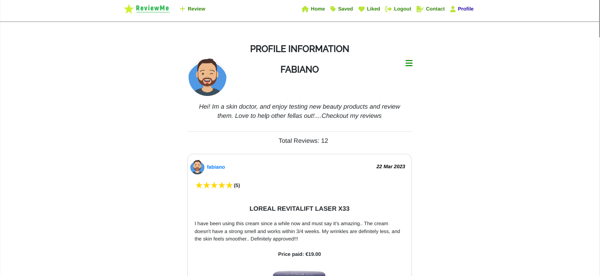

# ReviewME


## Introduction

ReviewME is a social media platform where users can review a beauty products and share their experience with others. We understand the importance of self-care and believe that everyone deserves to feel confident and beautiful.
And this platform was designed as a tool to provide honest feedback and analysis of a specific beauty product (i.e creams, oils, makeup ).
Nowdays, internet and social media is marketed in a way that makes it hard to find trustworthy sources, as such, Review is the perfect app to identify and consult honest feedback left in realtime.

The backend DRF API linked to this project, is available [here](https://github.com/aimansae/reviewme-api/) All details have been documented carefully in README file.

## Live Site

Deployed Frontend live [link](https://reviewme.herokuapp.com/)

Deployed Backend API [link](https://drf-reviewme.herokuapp.com/)

## Github Repository

Frontend [Repository](https://github.com/aimansae/reviewme)  
Backend [Repository](https://github.com/aimansae/reviewme-api)

## Table Of Contents

-   [Introduction](#introduction 'Introduction')
    -   [Live-site](#live-site 'Live Site')
    -   [Github Repository](#github-repository 'Github Repository')
-   [Ux User Experience](#ux-user-experience 'UX User Experience')
    -   [User Stories](#user-stories 'User Stories') 
    -   [Agile Methodology](#agile-methodology 'Agile Methodology')
    -   [Design](#design 'Design')
        -   [Typography](#typography 'Typography')
        -   [Wireframes](#wireframes 'Wireframes')
-   [Features](#features 'Features')
    -   [Navbar](#navbar 'Navbar')
    -   [Homepage](#homepage 'Homepage')
    -   [Review Detail Page](#review-detail-page 'Review Detail Page')
    -   [Review Edit](#review-edit 'Review Edit')
    -   [Profile Page](#profile-page 'Profile Page')
    -   [Saved Page](#saved-page 'Saved Page')
    -   [Liked Page](#liked-page 'Liked Page')
    -   [Contact Page](#liked-page 'Contact Page')
-   [Future Features](#future-features 'Future Features')
-   [Testing](#testing 'Testing')
-   [Bugs](#bugs 'Bugs')
    -   [Known Bug-Issues](#known-bug-issues 'Known Bug-Issues')
-   [Technologies used](#technologies-used 'Technologies used')
    -   [Frameworks Libraries](#frameworks-libraries 'Frameworks Libraries Used')
-   [Additional Resources](#additional-resources 'Additional Resources')
-   [Deployment](#deployment 'Deployment')
-   [Credits](#credits 'Credits')
-   [Media](#media 'Media')

## UX User Experience

ReviewMe website is created as a social media app where users are able to signin and review a product they have used.

Users are able to:

-   see all the product reviews,
-   create, edit delete their review
-   like and save a review
-   place comment and see comments from other users
-   see how many reviews a certain user has placed
-   contact the customer service for any query

### User Stories

User stories for backend API can be found in a separate [file](https://github.com/aimansae/reviewme-api/blob/main/static/readmeDocs/userstories.md)

User stories for the frontend project can be found through [Github Issues](https://github.com/aimansae/reviewme/issues) and [Kanban Board](https://github.com/users/aimansae/projects/6) can also be consulted directly.

## Agile Methodology

This project is created following Agile Methodology, by separating each user story in Epics. User stories are linked above.

## Design

### Color Scheme

The website color were chosen in an intuitive way so the user has an immediate idea of what the site is about. Different shades of green were used, as shown below. A customized logo was created to make the website unique and user friendly.


### Typography

A mix of Google [Fonts Raleway](https://fonts.google.com/?query=raleway) and [Lato](https://fonts.google.com/?query=lato) was used throughout the website

### Wireframes

<details>
<summary><strong>A skeleton of the initial projcet view can be found here below
</strong></summary>
<br>


- Signin and Signup Page


- Home Page for Logged out users: 


- Home Page for Logged in users: 


- Review deatil page not logged in users wil not see the comment form, just comment list: 


- Review liked and saved pages, logged out users wil not see these 2 pages


- Contact Page


- Profile Page


- Smartphone View


</details>
<br>

## Features

### Navbar

Navigation bar is fully responsive across all devices, and shows all available pages, according to a logged in or logged out user.
A search field is shown across all pages. Users can search by a product name

**For Logged In users:**


**For Logged out users:**


### Homepage

Homepage shows the review list to all users


### Review Detail Page

shows information related to the single review, upon click shows all the details and relative comments are displayed. For logged in users a form to place a comment will appear. Non logged in users will not see the form.

**For Logged In users:**


**For Logged out users:**


### Review Edit

If user is the owner of the review, a dropdown menu to edit or delete the review is shown.

For edit button a form prepopulated with previous data will appear and users will be able to make the necessary changes. Same logic for comments applies

Logged out users are not able to access review/id/edit page. They are redirected to homepage instead


For delete button a modal to ask for delete confirmation will be shown, same logic applies for comments.


### Profile Page

Logged in users can see their own profile page, which will show their bio, number or review and their reviews.
Profile owner has access to a dropdown menu to modify/change their personal details




Upon clicking on other users avatar, any user, logged in or not is redirected to their profile information


### Saved Page

Logged in users can check their saved reviews, by clicking on the saved page in the navbar.

Save tag will be green if the post was saved. This functionality allows users to save any review without necessarily having to like a post to view it later.

Logged out users are redirected to homepage.


### Liked Page

Logged in users can check their liked reviews, by clicking on liked page in the navbar.

Like heart icon will be red if the post was liked and the count increases by 1. This functionality allows users check out all the reviews they liked any time.

Unlike functionality reverses the like color and count as expected.

Logged out users have no access to liked page and are redirected to the homepage.


### Contact Page

Logged in users have access to contact page in case they have a question or a feedbacks. This is intended so a user, to know more about the platform has to signup. This part will be used in future for marketing purposes, to incourage registered users to insert their reviews.

After a from is submitted successfully a message will appear.


## FUTURE FEATURES:

-   allow users to filter product by most reviews product, by profile, price and other different criterias.
-   Based on the country the reviewer is placed in, a country field will be automatically prefilled and shown on the review. Users will be able to change/modity this field directly from their profile.
-   allow users to post more than 1 picture for a product, so the review feels more reliable and accurate.
-   show accurate messages if a non logged in user tries to access pages they can't, instead of being redirected to the homepage.
-   show contact page to non logged in users,  but upon submission a form will appear confirming that user must signup in order to send a contact request.
-   show a message when an edit action went through successfully possibly the message wil have a timer function
-   show a message when unsave review action is performed
- In the future users will be able to delete their profile
- Users will be able to login with Googole accounts
- Users will be able to contact the review owner to ask for opinions or suggestions
- Comments will have like/ unlike functionality as well


## Testing

## Manual testing:
<details>
<summary><strong>Manual testing is available here
</strong></summary>
<br>

| Testing                                                                                                                                 | Passed             |
| --------------------------------------------------------------------------------------------------------------------------------------- | ------------------ |
| **Signup page**                                                                                                                         | :white_check_mark: |
| Signup form renders correcty                                                                                                            | :white_check_mark: |
| Signup form renders correcty                                                                                                            | :white_check_mark: |
| Login link for existing users redirects to login form                                                                                   | :white_check_mark: |
| Upon clicing on 'signup' login form shows as expected                                                                                                | :white_check_mark: |
| Upon clicking on login button after inserting the info, user is redirected to homepage                                                                            | :white_check_mark: |
| Navbar is updated correctly with content for logged in users                                                                            | :white_check_mark: |
| **Login page**                                                                                                                          | :white_check_mark: |
| Existing users login redirects to homepage correctly                                                                                    | :white_check_mark: |
| Signup link for non exsiting users redirects to login form                                                                             | :white_check_mark: |
| Navbar is updated correctly with content for logged in users                                                                            | :white_check_mark: |
| **Logout page**                                                                                                                         | :white_check_mark: |
| Existing users successful logout redirects to homepage correctly                                                                        | :white_check_mark: |
| Navbar is updated correctly with content for logged out users                                                                           | :white_check_mark: |
| **Navbar for logged in users**                                                                                                          | :white_check_mark: |
| ReviewMe logo directs to homepage                                                                                                       | :white_check_mark: |
| Review create button directs to the form correctly                                                                                      | :white_check_mark: |
| Saved page appears correctly                                                                                                            | :white_check_mark: |
| Saved page shows no result found, if user has not saved a review yet                                                                    | :white_check_mark: |
| Liked page appears correctly                                                                                                            | :white_check_mark: |
| Liked page shows no result found, if user has not liked a review yet                                                                    | :white_check_mark: |
| Contact form appears correctly, with about us info                                                                                      | :white_check_mark: |
| Profile page shows content correctly                                                                                                    | :white_check_mark: |
| If a user has not posted a review, no result image appears correctly                                                                    | :white_check_mark: |
| **Navbar for logged in users**                                                                                                          | :white_check_mark: |
| Home page appears correctly, users can view any content                                                                                 | :white_check_mark: |
| Spinner while content is loading shows correctly                                                                                        | :white_check_mark: |
| Login/ signup pages appear correctly                                                                                                    | :white_check_mark: |
| Navbar is responsive and toggled depending on the device                                                                                | :white_check_mark: |
| **Endpoints for logged in users**                                                                                                       | :white_check_mark: |
| /signup directs to homepage                                                                                                             | :white_check_mark: |
| login/ directs to homepage                                                                                                              | :white_check_mark: |
| saved/ directs to saved page                                                                                                            | :white_check_mark: |
| liked/ directs to liked page                                                                                                            | :white_check_mark: |
| reviews:id/ directs user to the correct review page                                                                                     | :white_check_mark: |
| profiles/:id directs to correct page                                                                                   | :white_check_mark: |
| contact/ directs to contact page                                                                                                          | :white_check_mark: |
| wrong input or non existing endpoint / directs to no-results page correctly                                                             | :white_check_mark: |
| **Endpoints for logged out in users**                                                                                                   | :white_check_mark: |
| /signup directs to signup form correctly                                                                                                | :white_check_mark: |
| login/ directs to login page                                                                                                            | :white_check_mark: |
| saved/ directs to home page                                                                                                             | :white_check_mark: |
| liked/ directs to home page                                                                                                             | :white_check_mark: |
| reviews:id/ directs user to the correct review page                                                                                     | :white_check_mark: |
| profiles/:id directs to correct page                                                                                   | :white_check_mark: |
| contact/ directs to home page                                                                                                           | :white_check_mark: |
| wrong input or non existing endpoint / directs to no-results page correctly                                                             | :white_check_mark: |
| **Search filter**                                                                                                                       | :white_check_mark: |
| search filter by product title/name renders products as intended                                                                        | :white_check_mark: |
| works on everypage for logged in/out users                                                                                                  | :white_check_mark: |
| **Reviews/Homepage for logged in users**                                                                                                | :white_check_mark: |
| Review content and details are shown correctly                                                                                          | :white_check_mark: |
| upon clicking on reviewer's avatar their profile page is rendered correctly with all the content                                        | :white_check_mark: |
| date of review is shown correctly                                                                                                       | :white_check_mark: |
| star rating component is showing according to rating given                                                                              | :white_check_mark: |
| hover on like button, if user is the post owner shows proper message (you can't like your own post)                                     | :white_check_mark: |
| if user is not the review owner, on click like icon changes color, count increases, review is saved in liked page                       | :white_check_mark: |
| if user is not the review owner, on click unlike icon changes color, count decreases                                                    | :white_check_mark: |
| hover on save button, if user is the post owner shows proper message (you can't save your own post)                                     | :white_check_mark: |
| if user is not the preview owner, click on save button changes color, review is saved in saved page                                     | :white_check_mark: |
| comment icon, upon click opens review detail page and show a form to insert a comment                                                   | :white_check_mark: |
| in case of no comments, a proper message is appearing                                                                                   | :white_check_mark: |
| **Reviews/Homepage for logged out users**                                                                                               | :white_check_mark: |
| Review content and details are shown correctly                                                                                          | :white_check_mark: |
| upon clicking on reviewer's avatar their profile page is rendered with all their info                                                   | :white_check_mark: |
| date of review is shown correctly                                                                                                       | :white_check_mark: |
| star rating component is showing according to rating given                                                                              | :white_check_mark: |
| hover on like button, shows proper message (login to like a post)                                                                       | :white_check_mark: |
| hover on save button, shows proper message (login to save a post)                                                                       | :white_check_mark: |
| comment icon, upon click opens review detail page and invites user to login                                                             | :white_check_mark: |
| in case of no comments, a proper message is appearing for unlogged users                                                                | :white_check_mark: |
| **Review Datail Page for logged in users**                                                                                             | :white_check_mark: |
| if user is post owner upon clicking on product image, a dropdown menu appears                                                           | :white_check_mark: |
| if edit button is clicked, a form with existing data is prepopulated user can edit the content                                          | :white_check_mark: |
| after saving edit changes, user is redirected to the previous page (review detail)                                                      | :white_check_mark: |
| if delete button is clicked, a modal requesting for confirmation appears, user can confirm or cancel the operation                      | :white_check_mark: |
| the form to place a comment appears user can leave their comments                                                                       | :white_check_mark: |
| after placing it, the comment is shown, with how long ago details                                                                       | :white_check_mark: |
| if user is comment owner, a dropdown appears                                                                                            | :white_check_mark: |
| if edit button is clicked, the form is editable, prefilled with existing data, user can edit the content                                | :white_check_mark: |
| after saving edit changes, user sees the edited comment right away                                                                      | :white_check_mark: |
| if delete button is clicked, a modal requesting for confirmation appears, user can confirm or cancel the operation                      | :white_check_mark: |
| if user is not the review owner, the entire content is rendered, the comment form appears, but dropdown to edit post is no longer shown | :white_check_mark: |
| **Review Detail Page for logged out users**                                                                                            |
| review detail page shows all the content, but user can not make further actions                                                         | :white_check_mark: |
| **Contact form for logged in users**                                                                                                    |
| contact page shows the form, upon submission a message appears                                                                           | :white_check_mark: |
| **Contact form for logged out users**                                                                                                   |
| contact page for logged out users is not available for now             | :white_check_mark: |
| **Profile Page**                                                                                                                        |
| only if user is profile owner, they can edit their username, password, bio, updated content is displayed correctly                      | :white_check_mark: |
| logged out users can see the profiles from other users correctly                                                                        | :white_check_mark: |
| **Validation**                                                                                                                          |
| all forms fields are validated and show proper alert messages if not filled correctly                                                   | :white_check_mark: |

<br>
</details>

## Validation

WAVE Web Accessibility Evaluation Tool
[W3C Validator](https://jigsaw.w3.org/css-validator/) was used for CSS validation, all passed with no error

Dev Tool lighouse was used to text overall the site


[Eslint](https://eslint.org/) was used for frontend code validation. multiple errors were fixed. Some have been deleted across the files. Code Institute Moment app wss used as guide,therefore most of the code structure was used in ReviewMe app as well.

Eslint setup caused multiple issues. 
Some of the disabled problems are:

- function component is not a function decleration
- 'element' is missing in prop validation
- unexpected block statement surrounding arrow body move the returned value immediately after the arrow (disabled  as its the same as Walkthrough)
- profile_id not in camel case // ignored as per CI walkthrough
- errors about unescaped characters  was also ignored as using the fix suggested was not displaying the word correctly.
- json not allowed in file extension  disabled
- /* eslint-disable react/no-array-index-key */
- /* eslint-disable no-shadow */
- /* eslint-disable react/jsx-filename-extension */
- /* eslint-disable import/no-extraneous-dependencies */
- /* eslint-disable no-bitwise */
- /* eslint-disable camelcase */
- /* eslint-disable react/no-children-prop */


## Bugs
- Error: Warning: validateDOMNesting(...): <div> cannot appear as a descendant of <p>. occured in Review.js
I wrapped my return statement in P instead of div. 
-   Fixed by Replacing paragraph tag with div tag
- Star rating component was not rendering the stars active colour of the stars.
**Fixed** thanks to tutor's help, by adding a ternary condition on on Reviews.js page return statement
- if a user searched manually for /profiles/id the reviews rendered did not correspond with the profile itelf. Mentor Matina provided a huge help uderstanding where the issue was coming from. Profile context data was rendering /profile:id where the id was undefined, the correct way to access the current user was /profiles/${currentUser.profile.id}. Fixed by replacing it.
- Star rating component not being prepopulaed in ReviewEditForm.js. The review object from the api was being returned correctly as intended, however the stars on the rating form itself were not diplayed with the rating star colour. **Fixed by** repeating the state for rating like so  setRating(rating); (line 58)


## Known Bug-Issues

- Unlike, Unsave functionality was followed from C.I. walkthrough. Upon clicking unlike or unsave, the review is not being removed immediately from the respective pages (Saved and Liked). User has to manually reload the page, in order to see the changes. This is definitely an issue that needs to be resolved in the future.
- Star review field on ReviewCreateForm can be sent without selecting the stars. At the moment the field is optionaly, but for future feature will need to be set as a mandatory field. 
- Console throws 401 / Unauthorized error if a user is not logged in. This type of error is acceptable as per C.I Walkthroughs, therefore ignored
- if a url with non existing review/ or profile is searched (i.e: /profile/1234 or /reviews/776) user is redirected to the homepage, but the console shows 404 Not Found/ Bad request. This is an expected behavious from the console, (as per Mentor's confirmation as well) but definitely will need to be fixed in the future.
- Some times when creating a review, product title's last letter is not uppercase. This will need resolving in the future.

## Technologies used

-   JavaScript
-   HTML
-   CSS

## Framework and Libraries

[Django REST Framework](https://www.django-rest-framework.org/) for backend API

[React](https://reactjs.org/) used to build frontend application

[React Bootstrap 4](https://react-bootstrap-v4.netlify.app/) Bootstrap library supporting React used to create responsive design and components

[Axios](https://www.axios.com/) is used to make HTTP requests throughout the app

[React-star-Component](https://www.npmjs.com/package/react-rating-stars-component) used to create five star rating

[Heroku](https://dashboard.heroku.com/) for deployment


## Additional Resources

-   Color shema Palette generated by using [Coolors](https://coolors.co/)
-   [Favicon](https://favicon.io/) to create favicon
-   [FontAwesome](https://fontawesome.com/icons) Icons used for UX purposes
-   [GoogleFonts](https://fonts.google.com/) font used throughout site
-   Resources on Youtube were consulted, especially [PedroTech videos](https://www.youtube.com/@PedroTechnologies) provided clear explaination about react basics

## Deployment

1. Create Gitpod workspace

-   Log in to Gitpod and click on ‘New’
-   Choose a Repository name (MUST in lower case because of React)
-   Add a description
-   Click on ‘Create Repository
-   Click on ‘Gitpod’ button to create empty workspace

Created react app using CI walkthrough dependencies:

in terminal enter command:

-       npx create-react-app . --template git+https://github.com/Code-Institute-Org/cra-template-moments.git --use-npm

INSTEAD OF JUST : npx create-react-app . --use-npm
(. to create review app in root directory so we wont need to use cd all time)

-   To check if the app is working in terminal enter command:
-       npm start

Installed packages with command npm install:

```react-bootstrap@1.6.3 bootstrap@4.6.0
    react-router-dom@5.3.0
    axios
    react-infinite-scroll-component
    msw --save-dev
    jwt-decode
    -g eslint
```

-   Add, commit and push changes to Gitpod

2. Create [Heroku](https://dashboard.heroku.com/) app

-   Click on ‘New’
-   Choose a unique app name
-   Select State

To connect app to Gitpod repo From Deploy tab:

-   Click on Github
-   Select repository
-   Click on Deploy branch
-   Click open App to check the deployed version

### Link App to API:

In api heroku settings, click Reveal Config Vars and add:

-   Key: CLIENT_ORIGIN | Value: https://react-app-name.herokuapp.com

-   Key: CLIENT_ORIGIN_DEV | Value: https://gitpod-browser-link.ws-eu54.gitpod.io

(without triling slash /)

-   create a file axiosDefaults.js and Install the Axios package. # [Credit Moments Walkthorugh](https://github.com/Code-Institute-Solutions/moments/blob/cf955d2f2e6f70f61c92d1f9de85558d8e49f3a8/src/api/axiosDefaults.js)

In package.json, in scripts add:

-   "heroku-prebuild": "npm install -g serve",

-   Create a Procfile with the following code:

-   web: serve -s build

## Credits

-   Code Institute walkthroughs for API and Moments app were used as a main guide to build this project. Im heavily crediting the code provided by the walkthrought lessons, both for DRF API and for MOMENTS app.

-   Tony A., a fellow student from Code Institute needs to be credited for help on the star rating functionality and the modal in my app, I was given awesome advices, patience and Guidance
    . Thank you for the rapid response and all the help you provided Tony!

-   Code Institute Tutors were heavily consulted due to errors and general queries for this app

-   Slack channel for Frontend was consulted and advices were taken into consideration

-   React documentation provided a huge help to understand components and especially [Hooks](https://www.youtube.com/watch?v=dpw9EHDh2bM&embeds_euri=https%3A%2F%2Freactjs.org%2F&feature=emb_logo) introduction, provided a great help in understanding React basic functionality

- Eslint setup was made thanks to a [guide](https://gist.github.com/ianmeigh/8e603b91a38d7829d959402bfcf29d3d) provided by a fellow student on Slack

-   Mentor Martina T. deserves a huge thanks you for all the mentoring, support and advices!

## Media

-   [Dribbble](https://dribbble.com/shots/7449073) was used for no-results image
-   [Pixaby](https://pixabay.com/vectors/upload-icon-insert-symbol-arrow-2935442/) was used for default upload product image.
